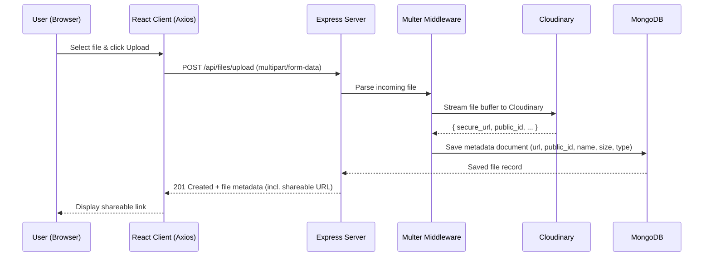

# ☁️ CloudVault

**A full-stack cloud file storage & sharing platform** built with React, Node.js, Express, MongoDB, and Cloudinary. Upload files, get an instant shareable link, and let a CDN handle delivery — while your database stays lean by storing only metadata, never raw file bytes.


---

## Table of Contents

- [Overview](#overview)
- [Features](#features)
- [Architecture & Design Decisions](#architecture--design-decisions)
- [Tech Stack](#tech-stack)
- [Project Structure](#project-structure)
- [REST API Reference](#rest-api-reference)
- [Data Model](#data-model)
- [Getting Started](#getting-started)
- [Environment Variables](#environment-variables)
- [Security Considerations](#security-considerations)
- [Future Enhancements](#future-enhancements)
- [Author](#author)

---

## Overview

CloudVault is a full-stack file storage and sharing platform that lets a user upload a file from the browser and immediately get back a public, shareable URL — similar in spirit to a lightweight WeTransfer or Google Drive link-sharing flow.

The project deliberately separates **file storage** from **metadata storage**: actual file bytes are pushed to Cloudinary's CDN, while MongoDB only ever holds lightweight metadata documents (URLs, public IDs, filenames, sizes, timestamps). This keeps the database small and fast, and lets file delivery ride on a CDN instead of the app server.

## Features

- **Secure file upload** — Files are received via `multipart/form-data`, validated, and streamed to Cloudinary rather than sitting on the app server's disk.
- **Shareable links** — Every successful upload returns a permanent, publicly accessible Cloudinary URL that can be copied and shared immediately.
- **Metadata-only database design** — MongoDB stores only file references (URL, Cloudinary public ID, name, type, size, upload date) instead of binary blobs, keeping reads/writes fast and the database footprint small.
- **RESTful API** — A clean Express API (`controllers/` + `routes/`) exposes upload, list, retrieve, and delete operations.
- **Multer-based upload handling** — Middleware parses incoming multipart requests before handing the file buffer/stream off to Cloudinary.
- **Axios-driven frontend** — The React client talks to the API exclusively through a centralized Axios layer, keeping HTTP logic out of components.

## Architecture & Design Decisions

### Why metadata-only storage?

A naive implementation would store uploaded files directly inside MongoDB (e.g., as Base64 blobs or via GridFS). CloudVault avoids this on purpose:

| Approach | Drawback |
|---|---|
| Store file bytes in MongoDB | Bloats the database, slows down queries/backups, no CDN caching |
| Store files on the app server's disk | Doesn't scale horizontally, lost on redeploys, no CDN edge caching |
| **Store files on Cloudinary, metadata in MongoDB** ✅ | Small, fast database + CDN-backed global delivery + independent scaling of storage vs. app |

MongoDB documents only ever contain **references** to the real asset — the URL and public ID Cloudinary returns after upload. The actual bytes never touch the database.

### Request flow



## Tech Stack

| Layer | Technology |
|---|---|
| Frontend | React, Axios |
| Backend | Node.js, Express.js |
| Database | MongoDB, Mongoose |
| File Storage / CDN | Cloudinary |
| Upload Handling | Multer |
| Config | dotenv |

## Project Structure

```
CloudVault/
├── client/                  # React frontend (SPA)
│   ├── src/
│   │   ├── components/      # Upload form, file list, share-link UI
│   │   ├── pages/           # Top-level views
│   │   └── services/        # Axios instance + API calls
│   └── package.json
├── config/                  # MongoDB connection + Cloudinary config
├── controllers/             # Request handlers / business logic for files
├── middleware/               # Multer upload config, error handling
├── models/                   # Mongoose schema(s) for file metadata
├── routes/                   # Express route definitions
├── server.js                 # App entry point (Express app + DB connect)
├── package.json               # Backend dependencies & scripts
└── .env                       # Environment variables (not committed)
```

## REST API Reference

| Method | Endpoint | Description | Body / Params |
|---|---|---|---|
| `POST` | `/api/files/upload` | Uploads a file via Multer, pushes it to Cloudinary, and saves the returned metadata to MongoDB | `multipart/form-data` with a `file` field |
| `GET` | `/api/files` | Returns metadata for all uploaded files | — |
| `GET` | `/api/files/:id` | Returns metadata (and shareable URL) for a single file | `id` — MongoDB document ID |
| `DELETE` | `/api/files/:id` | Removes the asset from Cloudinary and deletes its metadata document | `id` — MongoDB document ID |

> Route names above reflect the standard CloudVault API surface — verify these against `routes/` if your naming differs.

## Data Model

A typical file metadata document stored in MongoDB:

```json
{
  "_id": "665f1c2e9a1b2c3d4e5f6789",
  "originalName": "project-report.pdf",
  "cloudinaryId": "cloudvault/files/abc123xyz",
  "url": "https://res.cloudinary.com/<cloud_name>/raw/upload/v1234567890/cloudvault/files/abc123xyz.pdf",
  "fileType": "application/pdf",
  "size": 245678,
  "uploadedAt": "2026-08-10T09:12:00.000Z"
}
```

## Getting Started

### Prerequisites

- [Node.js](https://nodejs.org/) (v18+ recommended)
- npm
- A [MongoDB](https://www.mongodb.com/) database (local instance or MongoDB Atlas)
- A [Cloudinary](https://cloudinary.com/) account (cloud name, API key, API secret)

### Installation

```bash
# 1. Clone the repository
git clone https://github.com/dmw14/CloudVault.git
cd CloudVault

# 2. Install backend dependencies
npm install

# 3. Install frontend dependencies
cd client
npm install
cd ..

# 4. Create a .env file in the project root (see Environment Variables below)

# 5. Start the backend server
npm start
# or, with nodemon during development:
npx nodemon server.js

# 6. In a separate terminal, start the React client
cd client
npm start
```

## Security Considerations

- **Upload validation** — Multer restricts accepted file types/sizes before anything reaches Cloudinary.
- **No persistent local storage** — Files are streamed through the server rather than saved to disk long-term, reducing server-side attack surface and cleanup overhead.
- **CDN-backed delivery** — Serving files from Cloudinary instead of the app server avoids exposing the backend directly to file-download traffic.
- **Environment-based secrets** — Database and Cloudinary credentials are kept out of source control via `.env` + `dotenv`.

## Future Enhancements

- User authentication (JWT) with per-user file ownership
- Expiring or password-protected share links
- Drag-and-drop upload UI with progress indicators
- Folder/collection organization for uploaded files
- File versioning and download analytics

## Author

**dmw14**
Repository: [github.com/dmw14/CloudVault](https://github.com/dmw14/CloudVault)
